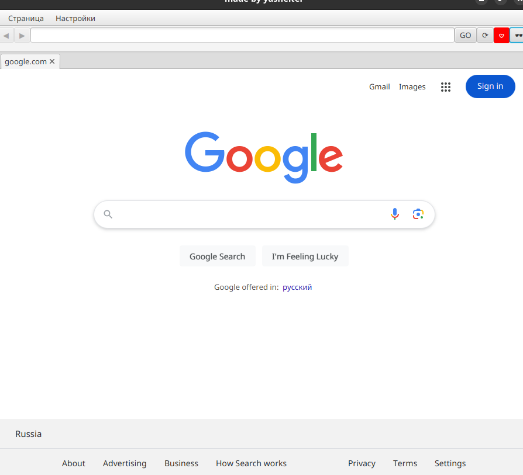
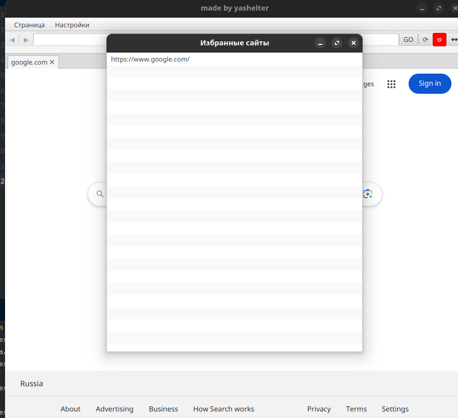
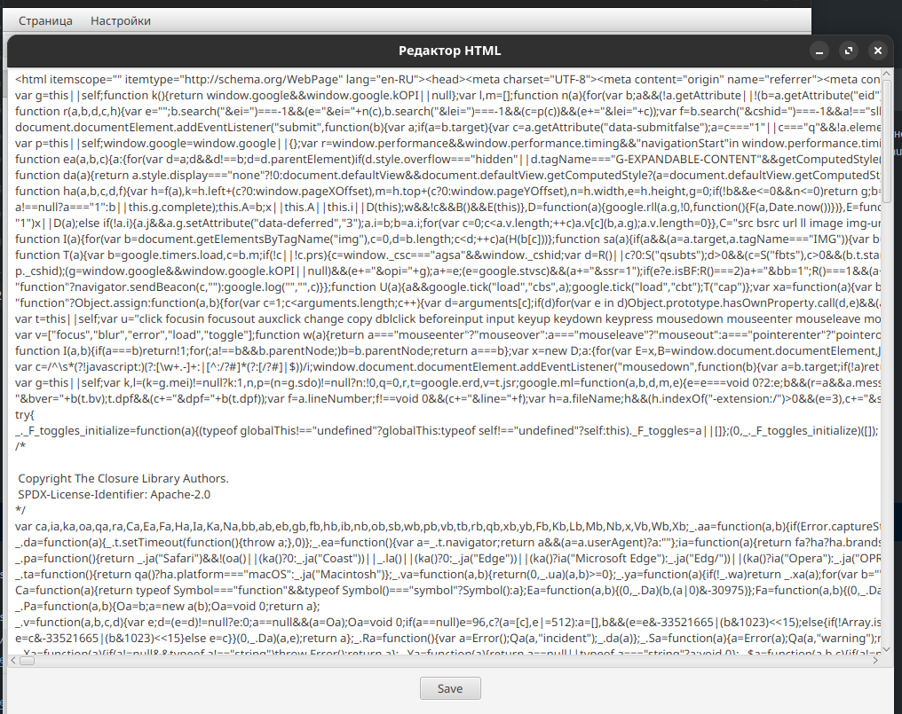
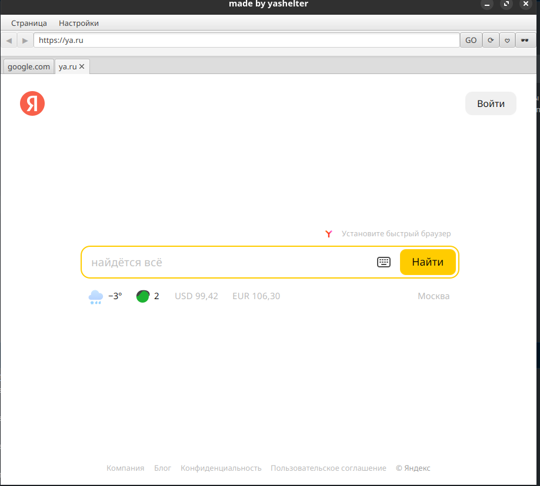
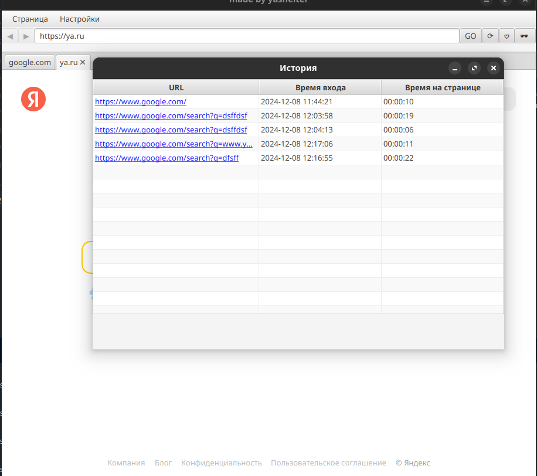

Для запуска из исходных клиента:
```bash 
mvn javafx:run 
```

Все главные действия реализованы в основном окне.
Для просмотра истории, избранных, приватных, скачивания zip и редактора кода используется menuBar
